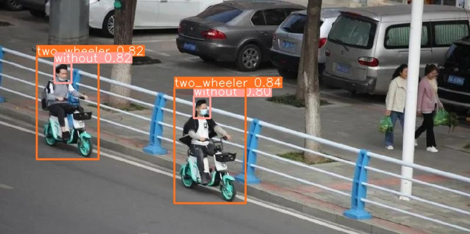
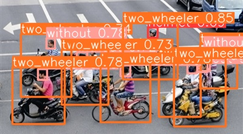
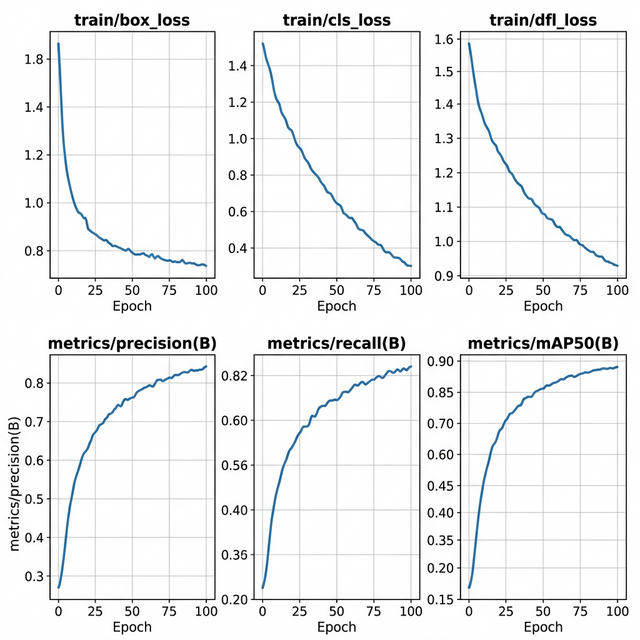

# YOLOv8 安全帽佩戴检测系统

基于 YOLOv8 的安全帽（头盔）佩戴检测系统，集成 PyQt5 图形化操作界面，支持摄像头实时检测、视频文件分析和图片识别，自动判断工人是否正确佩戴安全帽。

## 痛点与目的

- **问题**：建筑施工现场、工厂车间等危险环境中，安全帽佩戴的监管长期依赖人工巡查，覆盖范围有限、漏检率高，安全事故时有发生
- **方案**：用 YOLOv8 目标检测算法自动识别画面中人员是否佩戴安全帽，代替人工巡检，实现 24 小时不间断自动监管
- **效果**：支持摄像头实时检测、视频回放分析和图片批量检测三种模式，配合 PyQt5 桌面 GUI 开箱即用

## 核心功能

- **实时摄像头检测**：调用摄像头实时检测安全帽佩戴状态
- **视频文件检测**：对监控录像进行逐帧安全帽检测
- **图片检测**：对单张图片进行安全帽佩戴情况标注
- **PyQt5 图形界面**：美观的可视化操作窗口，支持多种检测模式切换
- **检测结果导出**：支持将检测结果保存为 CSV 文件
- **模型训练**：支持使用自定义数据集训练 YOLOv8 检测模型
- **中文标签显示**：支持中文类别名称在图像上的绘制

## 使用说明

### 环境安装

```bash
pip install -r requirements.txt
```

### 启动检测界面

```bash
python MainProgram.py
```

### 训练自定义模型

```bash
python train.py
```

训练前需修改 `train.py` 中数据集路径，数据集放置于 `datasets/` 目录下。

## 项目结构

```
.
├── MainProgram.py        # 程序主入口（PyQt5 GUI）
├── detect_tools.py       # 检测工具函数（绘框、标注等）
├── Config.py             # 全局配置
├── train.py              # YOLOv8 模型训练脚本
├── CameraTest.py         # 摄像头测试
├── VideoTest.py          # 视频检测测试
├── imgTest.py            # 图片检测测试
├── setup.py              # 安装配置
├── installPackages.py    # 依赖安装脚本
├── UIProgram/            # GUI 界面模块
│   ├── UiMain.py         # 主界面逻辑
│   ├── UiMain.ui         # Qt Designer 界面文件
│   ├── style.css         # 界面样式
│   ├── QssLoader.py      # 样式加载器
│   └── ui_imgs/          # 界面图标资源
├── Font/                 # 中文字体文件
├── models/               # 模型权重
├── datasets/             # 训练数据集
├── TestFiles/            # 测试文件
├── runs/                 # 训练输出
├── save_data/            # 检测结果保存
└── requirements.txt      # 项目依赖
```

## 检测效果展示

### 安全帽佩戴检测结果





### 训练指标曲线



## 适用场景

- 建筑施工现场安全监管
- 工厂车间安全帽检测
- 矿山作业安全监控
- 智慧工地管理系统

## 技术栈

| 组件 | 技术 |
|------|------|
| 目标检测 | YOLOv8 (ultralytics) |
| 图形界面 | PyQt5 |
| 深度学习 | PyTorch |
| 图像处理 | OpenCV, Pillow |
| 数据可视化 | Matplotlib, Seaborn |

## 许可证

MIT 许可证
